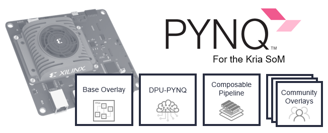

This repository contains the install scripts needed to add PYNQ to the official Ubuntu SDCard Image of your:
* Kria KV260 Vision AI Starter Kit  
* Kria KR260 Robotic Starter Kit

From that installation, a complete Python and Jupyter environment is installed on the Kria SOM along with multiple programmable logic overlays all ready to use.  

## Installation

#### 1. Get the Ubuntu SD Card Image 

#### Users of Ubuntu 22.04 LTS
If you wish to run Ubuntu 22.04 LTS, you may need to update the boot firmware to the latest version. For example, 2022.1 boot firmware is recommended for Ubuntu 22.04 LTS user. Ubuntu may not boot with mismatched firmware.
The update methods can be found in [Kria Wiki](https://xilinx-wiki.atlassian.net/wiki/spaces/A/pages/1641152513/Kria+K26+SOM#Ubuntu-LTS).

#### KV260
Follow the steps to [Get Started with Kria KV260 Vision AI Starter Kit](https://www.xilinx.com/products/som/kria/kv260-vision-starter-kit/kv260-getting-started-ubuntu/setting-up-the-sd-card-image.html) until you complete the [Booting your Starter Kit](https://www.xilinx.com/products/som/kria/kv260-vision-starter-kit/kv260-getting-started-ubuntu/booting-your-starter-kit.html) section.

#### KR260
Follow the steps to [Get Started with Kria KR260 Robotic Starter Kit](https://www.xilinx.com/products/som/kria/kr260-robotics-starter-kit/kr260-getting-started/setting-up-the-sd-card-image.html) until you complete the [Booting your Starter Kit](https://www.xilinx.com/products/som/kria/kr260-robotics-starter-kit/kr260-getting-started/booting-your-starter-kit.html) section.

#### 2. Install PYNQ
Then install PYNQ on your Kria device.  Simply clone this repository from your Kria and run the install.sh script specifying the device with the `-b` flag.

```bash
git clone https://github.com/Xilinx/Kria-PYNQ.git
cd Kria-PYNQ/
sudo bash install.sh -b { KV260 | KR260 } 
```

This script will install the required debian packages, create Python virtual environment and configure a Jupyter portal.  This process takes around 25 minutes.

#### 3. Open Jupyter

JupyterLab can now be accessed via a web browser `<ip_address>:9090/lab` or `kria:9090/lab`. The password is **xilinx**

## Included Overlays

#### Base Overlay [\[GitHub\]](kv260/base) 

This overlay includes support for the KV260's Raspberry Pi camera and PMOD interfaces.  A [Digilent Pcam 5C](https://digilent.com/reference/add-ons/pcam-5c/start?redirect=1) camera can be attached to the KV260 and controlled from Jupyter notebooks.  Additionally, a variety of Grove and PMOD devices are supported on the PMOD interface - all controllable from a Xilinx Microblaze processor in programmable logic.  

__Supported boards__: _KV260_ 

#### DPU-PYNQ (v2.5) [\[GitHub\]](https://github.com/Xilinx/DPU-PYNQ) [\[PYPI\]](https://pypi.org/project/pynq-dpu/)
This overlay contains a Vitis-AI 2.5.0 Deep Learning Processor Unit (DPU) and comes with a variety of notebook examples with pre-trained ML models.

__Supported boards__: _KV260_, _KR260_ 

#### Composable Pipeline (v1.1 soft-release) [\[GitHub\]](https://github.com/Xilinx/PYNQ_Composable_Pipeline) 
The Composable pipeline is an overlay with a novel and clever architecture that allow us to adapt how the data flows between a series of IP cores.

__Supported boards__: _KV260_ 

#### PYNQ-Helloworld [\[GitHub\]](https://github.com/Xilinx/PYNQ-HelloWorld) [\[PYPI\]](https://pypi.org/project/pynq-helloworld/)
One of PYNQ's first overlays, the PYNQ-Helloworld overlay includes an image resizer block in programmable logic.  This overlay demonstrates a simple but powerful use of programmable logic HLS blocks to do image processing. 

__Supported boards__: _KV260_, _KR260_ 

## Selftest

A self-test script for each board is generated at the end of the build. This test script runs some of the Overlay tests. To run the self-test navigate to the ``Kria-PYNQ`` install directory and run:
```bash
sudo ./selftest.sh
```

## References

- [PYNQ](https://www.pynq.io)
- [KV260 Vision AI Starter Kit](https://www.xilinx.com/products/som/kria/kv260-vision-starter-kit)
- [KR260 Robotic Starter Kit](https://www.xilinx.com/products/som/kria/kr260-robotics-starter-kit.html)
- [Canonical Xilinx Ubuntu Images](https://ubuntu.com/download/xilinx)
- [Kria K26 SOM WiKi](https://xilinx-wiki.atlassian.net/wiki/spaces/A/pages/1641152513/Kria+K26+SOM#)


----
----

Copyright (C) 2021 Xilinx, Inc

SPDX-License-Identifier: BSD-3 License
